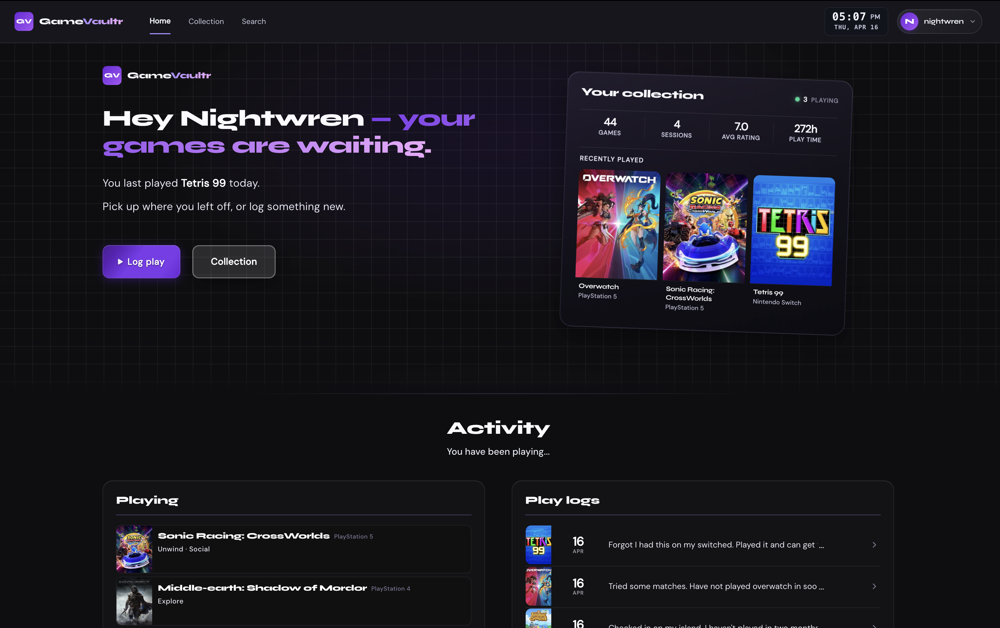
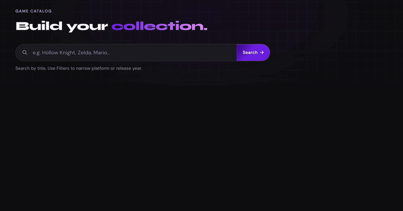

# Gamevaultr

Gamevaultr is a personal game vault: build your game collection, then track playthroughs, sessions, ratings, and notes in one place.

## Live Website - Fully useable

[gamevaultr.com](https://gamevaultr.com)

### Use the credentials below to explore the application
Username: demo 
Password: demopassword

## What You Can Do

- Search add games to your collection
- Track ownership, play status, and progress for each game
- Manage playthroughs history and current run context
- Log individual play sessions with notes and reflections
- Record ratings, reviews, notes and personal insights
- Track playtime with a built-in session timer

## Product Preview
### Home - your collection at a glance

### Search and Add - build your library quickly 

## Collection - organize and manage your games

## Game tracking — pick up exactly where you left off

## Session logging - record each play session

## Session Timer — track your playtime in real time

## Tech Stack

- Backend: Spring Boot 4 (MVC)
- Language: Java 21
- Build: Maven (`mvn` / `./mvnw`)
- Data layer: Spring Data JPA + Hibernate
- Database: PostgreSQL (default), H2 (local profile)
- Security: Spring Security
- Views: Thymeleaf + static assets
- External API: IGDB (Twitch credentials)
- Caching: Caffeine (service-level cache)

